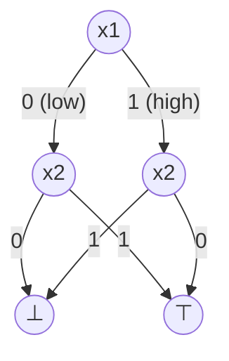
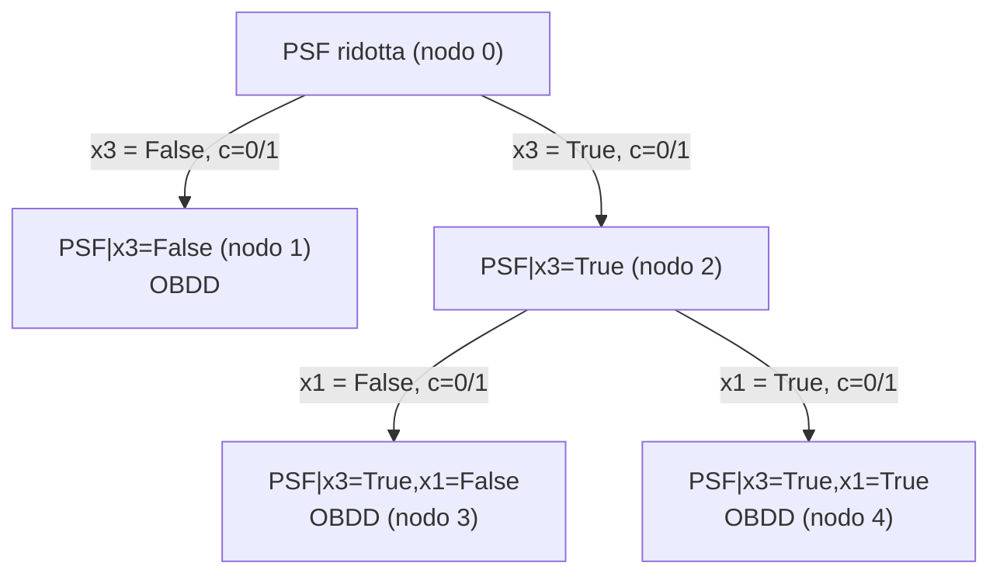
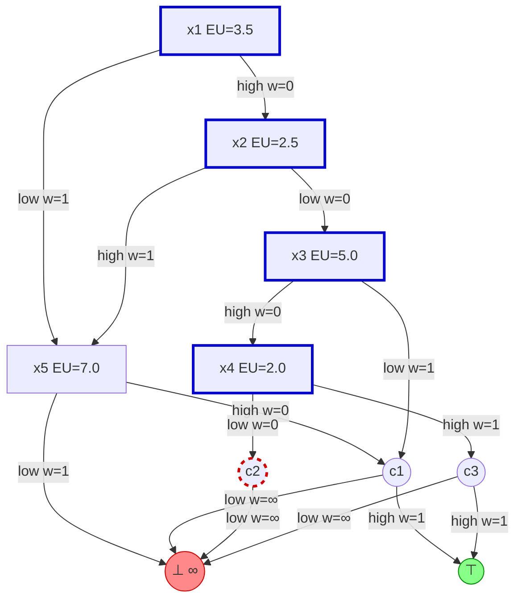
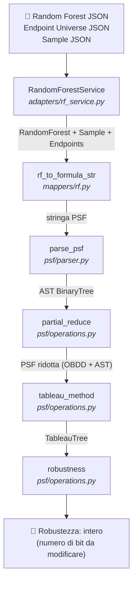

# Robustness of Random Forests on Multiclass Data

## Panoramica del progetto

Questo progetto implementa un sistema per il calcolo della **robustezza** di un classificatore *Random Forest* su dati multiclasse. L'obiettivo è determinare, dato un campione classificato correttamente dalla foresta, la distanza minima (in termini di perturbazioni binarie sulle feature) che è necessario percorrere nello spazio delle feature per ottenere una classificazione diversa.

Il progetto si sviluppa in due componenti principali:

1. **`Random_Forest_Aeon_Univariate/`** — componente del professore: addestra una Random Forest su dataset di serie temporali univariate (tramite la libreria [Aeon](https://www.aeon-toolkit.org/)) e serializza la foresta, i campioni di test e l'*endpoint universe* in formato JSON.
2. **`src/robustness/`** — componente sviluppata in questo lavoro: legge i file prodotti dal componente precedente e calcola la robustezza applicando il *Tableau Method* su una formula Booleana che codifica la foresta.

---

## Background teorico

### Random Forest

Una *Random Forest* è un insieme di $n$ alberi decisionali $\{T_1, \ldots, T_n\}$, ognuno dei quali partiziona lo spazio delle feature tramite soglie sulle variabili di input. La predizione della foresta è determinata dal voto di maggioranza fra le predizioni dei singoli alberi.

Ogni cammino radice-foglia in un albero $T_i$ definisce una congiunzione di condizioni booleane della forma $x_j \leq \theta$ (ramo *low*) oppure $x_j > \theta$ (ramo *high*).

### Endpoint Universe

L'*Endpoint Universe* $\mathcal{EU}$ è un dizionario che associa ad ogni feature $f$ una soglia $\theta_f \in \mathbb{R}$. Questa soglia funge da punto di bisezione dello spazio continuo della feature: ogni valore $x_f \leq \theta_f$ è codificato come il bit `0`, ogni valore $x_f > \theta_f$ è codificato come il bit `1`.

### Encoding Booleano della Random Forest (PSF)

Per poter ragionare formalmente sulla foresta, la Random Forest viene convertita in una formula booleana chiamata **PSF** (*Propositional Set Formula*). La conversione avviene enumerando tutti i cammini radice-foglia di tutti gli alberi.

Ogni cammino produce una congiunzione di letterali booleani. La formula complessiva è una disgiunzione di tali congiunzioni, nella forma:

```
PSF = (l₁₁ ∧ l₁₂ ∧ … ∧ cK₁) ∨ (l₂₁ ∧ l₂₂ ∧ … ∧ cK₂) ∨ …
```

dove ogni `lᵢⱼ` è un letterale su una variabile di feature (o la sua negazione) e `cKᵢ` è la variabile di **classe** associata alla foglia (ad esempio `c1` per la classe `1`).

La conversione è implementata in `src/robustness/domain/mappers/rf.py`:

```python
# src/robustness/domain/mappers/rf.py

def rf_to_formula_str(rf: _RF_Type) -> str:
    # Per ogni albero, enumera tutti i cammini radice-foglia
    groups = [c for tree in rf for c in dt_to_formula_str(tree.root)]
    # Ogni cammino diventa una congiunzione di letterali
    and_expr = [" & ".join(reversed(group)) for group in groups]
    # La PSF è la disgiunzione di tutti i cammini
    formula = f"({") | (".join(and_expr)})"
    return formula

def dt_to_formula_str(root: _DT_Node_Type) -> list[list[str]]:
    if isinstance(root, _DT_Internal_Type):
        low_condition  = f"(! {root.feature})"   # feature <= EU[feature] → bit 0
        high_condition = root.feature              # feature >  EU[feature] → bit 1
        # ricorsione sui figli e aggiunta della condizione corrente
        ...
    if isinstance(root, _DT_Leaf_Type):
        return [[f"c{root.label}"]]               # variabile di classe
```

### Ordered Binary Decision Diagram (OBDD)

Un **OBDD** (*Ordered Binary Decision Diagram*) è una rappresentazione compatta e canonica di una funzione booleana. I nodi interni sono etichettati con variabili booleane e hanno due archi figli: *low* (variabile = 0) e *high* (variabile = 1). I nodi terminali sono `True` (⊤) e `False` (⊥).

Esempio di OBDD per la formula `(x1 ∧ ¬x2) ∨ (¬x1 ∧ x2)` (XOR):



La dimensione di un OBDD è misurata dal numero di nodi nel DAG (`dag_size`). La gestione degli OBDD è affidata alla libreria [`dd`](https://github.com/tulip-control/dd).

### Riduzione parziale della PSF (`partial_reduce`)

Poiché la PSF può essere molto grande, non è sempre possibile ridurla direttamente a un singolo OBDD. La funzione `partial_reduce` applica un approccio **bottom-up**: visita l'AST della formula in post-ordine e converte i sottoalberi in OBDD solo se la dimensione risultante è al di sotto del parametro `diagram_size`. Se la dimensione supera la soglia, il nodo rimane nella forma simbolica (AST).

`partial_reduce` può anche ricevere un'assegnazione parziale di variabili: in tal caso specializza la formula applicando l'assegnazione prima della riduzione.

```python
# src/robustness/domain/psf/operations.py  (estratto semplificato)

def partial_reduce(psf: PSF, diagram_size: int, assignment: dict[str, bool] = None):
    for psf_node_id in psf.postorder_iter():     # visita bottom-up
        kind = psf.get_node_attrs(psf_node_id)['kind']

        if kind == Kind.AND:
            # Tenta di unire i due figli in un OBDD tramite AND booleano
            if left_is_bdd and right_is_bdd:
                new_bdd = manager.apply("and", bdd_left, bdd_right)
                # Tieni il risultato solo se non supera la soglia
                outcome = new_bdd.dag_size <= diagram_size
                ...
            else:
                # Almeno un figlio non è ancora un OBDD: rimane come nodo AST
                node_id = builder.And(left_id, right_id)
        ...
    return reduced_tree, last_outcome
```

### Tableau Method

Il **Tableau Method** estende la riduzione parziale con una strategia di *splitting*: si costruisce un albero (il *Tableau Tree*) dove ogni nodo contiene una PSF parzialmente ridotta.

L'algoritmo opera come segue:

1. Si applica `partial_reduce` alla PSF iniziale.
2. Se il risultato è già un singolo OBDD, il nodo diventa una **foglia** del tableau.
3. Altrimenti, si sceglie la variabile di feature più frequente negli OBDD della formula (*best feature*) e si creano due nodi figli:
   - **ramo low**: la variabile è assegnata a `False`
   - **ramo high**: la variabile è assegnata a `True`
4. Per ciascun figlio si riesegue `partial_reduce` con l'assegnazione della variabile prescelta.
5. Il processo continua ricorsivamente fino a quando ogni foglia contiene un singolo OBDD.

Esempio di Tableau Tree dopo lo splitting su `x3`, poi su `x1`:



Implementazione del loop principale del tableau:

```python
# src/robustness/domain/psf/operations.py

def tableau_method(f: PSF) -> TableauTree:
    tree = tb.Builder()
    root = tree.add_tree(f, "Initial Reduced-PSF")
    frontier = deque([root])

    while frontier:
        current = frontier.pop()
        current_tree = tree.T.nodes[current]['tree']

        if is_bdd(current_tree):
            continue                          # foglia: già un OBDD

        best_var, _ = best_feature(current_tree)  # variabile più frequente

        # Ramo low: assegna best_var = False
        low_tree, _ = partial_reduce(current_tree, config.diagram_size, {best_var: False})
        low_id = tree.add_tree(low_tree, best_feature(low_tree)[0])
        tree.assign(current, low_id, best_var, False)
        frontier.append(low_id)

        # Ramo high: assegna best_var = True
        high_tree, _ = partial_reduce(current_tree, config.diagram_size, {best_var: True})
        high_id = tree.add_tree(high_tree, best_feature(high_tree)[0])
        tree.assign(current, high_id, best_var, True)
        frontier.append(high_id)

    return tree.build()
```

### Calcolo della robustezza su un OBDD

Dato un sample $s$ e un OBDD $f$, la robustezza sull'OBDD è calcolata come segue:

1. Si costruisce un **DAG di robustezza** a partire dall'OBDD assegnando i pesi agli archi tramite confronto con l'*Endpoint Universe* (EU):
   - Nodo feature $x_i$: se $s_{x_i} \leq \mathcal{EU}(x_i)$ → ramo **low** peso `0`, ramo **high** peso `1`; se $s_{x_i} > \mathcal{EU}(x_i)$ → ramo **high** peso `0`, ramo **low** peso `1`.
   - Nodo classe: ramo **high** → `⊤` (peso `1`), ramo **low** → `⊥` (peso `+∞`).
   - Il ramo *high* del nodo corrispondente alla **classe predetta** da $s$ viene rimosso.
2. La robustezza è la **lunghezza del cammino minimo** nel DAG pesato dal nodo radice al nodo `⊤`.

Esempio con sample $s = \{x_1{:}5.0,\; x_2{:}1.0,\; x_3{:}8.0,\; x_4{:}0.5,\; x_5{:}9.0\}$,
soglie EU $= \{x_1{:}3.5,\; x_2{:}2.5,\; x_3{:}5.0,\; x_4{:}2.0,\; x_5{:}7.0\}$, classe predetta `c2`.

Confronti EU che determinano i pesi (arco con confronto vero → w=0):

| nodo | confronto        | low | high |
|------|------------------|-----|------|
| x1   | 5.0 > EU=3.5     | w=1 | **w=0** |
| x2   | 1.0 ≤ EU=2.5     | **w=0** | w=1 |
| x3   | 8.0 > EU=5.0     | w=1 | **w=0** |
| x4   | 0.5 ≤ EU=2.0     | **w=0** | w=1 |
| x5   | 9.0 > EU=7.0     | w=1 | **w=0** |



> **Percorso del sample (nodi con bordo blu):** `x1 --high(w=0)→ x2 --low(w=0)→ x3 --high(w=0)→ x4 --low(w=0)→ c2` → bloccato (ramo high di `c2` rimosso).
> Il cammino minimo verso `⊤` è p.es. `x1→x2→x3→x4--high(w=1)→c3--high(w=1)→⊤` con costo `0+0+0+1+1 = 2`.
> **Robustezza = 2**: occorre perturbare il valore di almeno 2 feature affinché il sample venga classificato diversamente da `c2`.

Tracciamento del percorso del sample nell'OBDD:

```python
# src/robustness/domain/bdd/operations.py

def test_sample(sample: Sample, manager: DD_Manager, f: DD_Function, endpoints: Endpoints) -> str:
    """Restituisce la stringa binaria del percorso radice→True nell'OBDD."""
    if f in {manager.false, manager.true}:
        return ""
    if is_class(f.var):
        # Variabile di classe: segue il ramo high se la classe predetta corrisponde
        if sample.predicted_label == f.var[1:]:
            return test_sample(sample, manager, f.high, endpoints) + "1"
        else:
            return test_sample(sample, manager, f.low, endpoints) + "0"
    # Variabile di feature: confronta con la soglia dell'Endpoint Universe
    if sample.features[f.var] <= endpoints[f.var]:
        return test_sample(sample, manager, f.low, endpoints) + "0"
    else:
        return test_sample(sample, manager, f.high, endpoints) + "1"
```

Calcolo della robustezza sull'OBDD tramite shortest path:

```python
# src/robustness/domain/mappers/bdd.py

def calculate_bdd_robustness(f: DD_Function, sample: Sample, endpoints: Endpoints) -> float:
    manager = get_bdd_manager()
    if f == manager.true:   return 0        # già True: robustezza 0
    if f == manager.false:  return math.inf # mai True: robustezza infinita

    path = test_sample(sample, manager, f, endpoints)
    dag  = construct_robustness_dag(manager, f, sample, path)

    # Dijkstra / BFS sul DAG pesato
    shortest_path = nx.shortest_path(dag, dag.root, dag.true(), weight="weight")
    return sum(dag[u][v].get('weight', 1) for u, v in zip(shortest_path, shortest_path[1:]))
```

### Calcolo della robustezza sul Tableau

La robustezza sul Tableau Tree è la robustezza minima calcolata sull'intero albero. Per ciascuna foglia (che contiene un OBDD), si calcola la robustezza sull'OBDD e si propaga il costo verso la radice sommando i costi degli archi del tableau.

Il costo di un arco nel tableau è definito dalla funzione $c(s, \mathcal{EU}, \text{var}, \text{asgn})$:

$$
c(s, \mathcal{EU}, \text{var}, \text{asgn}) = \begin{cases} 0 & \text{se asgn} = \text{False} \land s[\text{var}] \leq \mathcal{EU}[\text{var}] \\ 0 & \text{se asgn} = \text{True} \land s[\text{var}] > \mathcal{EU}[\text{var}] \\ 1 & \text{altrimenti} \end{cases}
$$

In parole: il costo è `0` se l'assegnazione del ramo tableau è **coerente** con il valore reale del campione (ovvero il campione si troverebbe naturalmente su quel ramo), e `1` altrimenti (il campione deve essere perturbato per seguire quel ramo).

La robustezza finale è:

$$
\rho(s) = \min_{\ell \in \text{foglie}} \left( \rho_{\text{OBDD}}(\ell, s) + \sum_{(u,v) \in \pi(r, \ell)} c(s, \mathcal{EU}, \text{var}_{(u,v)}, \text{asgn}_{(u,v)}) \right)
$$

dove $\pi(r, \ell)$ è il percorso dalla radice alla foglia $\ell$ nel Tableau Tree.

Implementazione della funzione di costo e propagazione:

```python
# src/robustness/domain/psf/operations.py

def robustness(t: TableauTree, sample: Sample, endpoints: Endpoints) -> int:
    memo = {}

    for leaf in t.leaves:
        bdd = t.nodes[leaf]['tree'].nodes[...]['value']
        memo[leaf] = calculate_bdd_robustness(bdd, sample, endpoints)

        current, parent = leaf, t.parent(leaf)
        while parent is not None:
            edge_data = t.edges[parent, current]
            var        = edge_data['var']
            path_cost  = memo[current]

            if not edge_data['is_high']:
                # ramo low: c = 0 se sample[var] <= EU[var], altrimenti 1
                path_cost += 0 if sample.features[var] <= endpoints[var] else 1
            else:
                # ramo high: c = 0 se sample[var] > EU[var], altrimenti 1
                path_cost += 0 if sample.features[var] > endpoints[var] else 1

            # Prendi il minimo tra i costi già visti per questo nodo
            memo[parent] = min(memo.get(parent, float('inf')), path_cost)
            current, parent = parent, t.parent(current)

    return memo[t.root_id]
```

---

## Architettura del sistema e pipeline



### Descrizione dei moduli principali

| Modulo | Percorso | Responsabilità |
|---|---|---|
| `RandomForestService` | `src/robustness/adapters/rf_service.py` | Lettura dei file JSON prodotti dal componente del professore |
| `rf_to_formula_str` | `src/robustness/domain/mappers/rf.py` | Conversione RF → formula PSF |
| `parse_psf` | `src/robustness/domain/psf/parser.py` | Parsing della formula PSF → AST |
| `partial_reduce` | `src/robustness/domain/psf/operations.py` | Riduzione parziale PSF → OBDD |
| `tableau_method` | `src/robustness/domain/psf/operations.py` | Costruzione del Tableau Tree |
| `robustness` | `src/robustness/domain/psf/operations.py` | Calcolo della robustezza sul Tableau |
| `calculate_bdd_robustness` | `src/robustness/domain/mappers/bdd.py` | Calcolo della robustezza su un singolo OBDD |

---

## Struttura del repository

```
robustness-random-forest/
├── Random_Forest_Aeon_Univariate/   # Componente del professore
│   ├── init_aeon_univariate.py      # Script per addestrare la RF e generare i file
│   ├── forest.py                    # Struttura dati Random Forest
│   ├── tree.py                      # Struttura dati Decision Tree
│   ├── eu.py                        # Calcolo dell'Endpoint Universe
│   ├── sample.py                    # Serializzazione dei campioni
│   └── results/                     # Output: RF, endpoint universe, sample JSON
│
├── src/
│   └── robustness/
│       ├── __main__.py              # Entry point CLI
│       ├── adapters/                # Lettura file (RandomForestService)
│       ├── domain/
│       │   ├── random_forest.py     # Modelli di dominio (RandomForest, Sample, Endpoints)
│       │   ├── bdd/                 # Gestione OBDD (dd library wrapper)
│       │   ├── psf/
│       │   │   ├── model.py         # Modello PSF (AST con Builder)
│       │   │   ├── parser.py        # Parser formula PSF
│       │   │   ├── operations.py    # partial_reduce, tableau_method, robustness
│       │   │   └── tableau/         # Modello TableauTree
│       │   ├── mappers/
│       │   │   ├── rf.py            # RF → formula PSF
│       │   │   ├── psf.py           # stringa → PSF
│       │   │   └── bdd.py           # Calcolo robustezza su OBDD
│       │   └── tree/                # Struttura BinaryTree generica
│       └── schemas/                 # Schemi Pydantic per i file JSON
│
├── tests/                           # Test unitari
├── pyproject.toml                   # Configurazione progetto e dipendenze
└── README.md
```

---

## Installazione

### Con Poetry (consigliato)

```bash
# Installare Poetry
curl -sSL https://install.python-poetry.org | python3 -

# Installare le dipendenze
poetry install
```

### Con venv

```bash
# Creare un ambiente virtuale
python3 -m venv venv

# Attivare l'ambiente
# macOS / Linux
source venv/bin/activate
# Windows (PowerShell)
venv\Scripts\activate

# Installare le dipendenze
pip install -r requirements.txt
```

---

## Utilizzo

### 1. Generazione della Random Forest (componente del professore)

```bash
cd Random_Forest_Aeon_Univariate

# Elencare i dataset disponibili
python init_aeon_univariate.py --list-datasets

# Addestrare la RF sul dataset "Coffee" (senza ottimizzazione)
python init_aeon_univariate.py Coffee

# Addestrare la RF con ottimizzazione Bayesiana degli iperparametri
python init_aeon_univariate.py Coffee --optimize
```

I risultati vengono salvati nella cartella `results/` con i seguenti file:
- `Coffee_random_forest.json` — la Random Forest serializzata
- `Coffee_endpoints_universe.json` — l'Endpoint Universe
- `sample_meta_Coffee_<group>_<id>.json` — i campioni di test

### 2. Calcolo della robustezza

```bash
# Con Poetry
poetry run robustness \
  --dataset-name Coffee \
  --rf-path ./Random_Forest_Aeon_Univariate/results \
  --sample-group 1 \
  --sample-id 0 \
  --diagram-size 50

# Oppure direttamente
python -m robustness \
  --dataset-name Coffee \
  --rf-path ./Random_Forest_Aeon_Univariate/results \
  --sample-group 1 \
  --sample-id 0
```

### Parametri CLI principali

| Parametro | Descrizione | Default |
|---|---|---|
| `--dataset-name`, `-dn` | Nome del dataset Aeon usato per addestrare la RF | `Meat` |
| `--rf-path` | Cartella contenente i file JSON della RF | `./Random_Forest_Aeon_Univariate/results` |
| `--sample-group` | Gruppo del campione da testare | `1` |
| `--sample-id` | ID del campione nel gruppo | `0` |
| `--diagram-size`, `-dd` | Dimensione massima dell'OBDD nella riduzione parziale | `50` |
| `--log-graphs` | Salva i grafi SVG nella cartella `logs/` | `False` |
| `--debug` | Abilita la modalità debug (include `--log-graphs`) | `False` |
